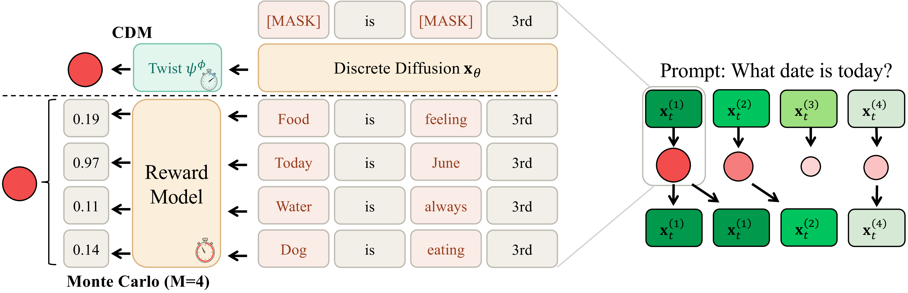

<div align=center>

# CDM: Contrastive Distribution Matching for<br>Amortized Sequential Monte Carlo in Discrete Diffusion

[Jaihoon Kim](https://jh27kim.github.io/) $^1$, [Taehoon Yoon](https://taehoon-yoon.github.io/) $^2$, [Prin Phunyaphibarn](https://prinphunya.github.io/) $^1$,

[Seungjun Kim](https://ksj626.github.io/) $^1$, [Morteza Mardani](https://mortezamardani.github.io/morteza/) $^3$, [Minhyuk Sung](https://mhsung.github.io/) $^1$

**$^1$ KAIST**   **$^2$ University of Michigan**   **$^3$ NVIDIA**

<p>
<a href='http://arxiv.org/abs/2605.23346'></a>
<a href='https://cdm-smc.github.io/'></a>
<a href="https://huggingface.co/jh27kim/cdm-checkpoints"></a>
</p>

</div>

Official PyTorch codebase for **Contrastive Distribution Matching for Amortized Sequential Monte
Carlo in Discrete Diffusion**. Twisted SMC steers a discrete diffusion model toward high-reward
samples, but its twist must be re-estimated at every denoising step by Monte Carlo rollout, and
that estimate dominates the sampling cost. CDM amortizes it into a twist head trained once with a
contrastive objective, so at inference a single backbone pass yields both the proposal logits and
the twist.

<p align="center">
  
</p>

## 📚 Table of Contents

- [Highlights](#highlights)
- [Applications](#applications)
- [Environment Setup](#environment-setup)
- [Pretrained Checkpoints](#pretrained-checkpoints)
- [Quick Start](#quick-start)
- [Base Twisted SMC](#base-twisted-smc)
- [Training](#training)
- [Inference](#inference)
- [Output Format](#output-format)
- [Repository Layout](#repository-layout)
- [Citation](#citation)
- [License](#license)
- [Acknowledgments](#acknowledgments)

## ✨ Highlights

- **One backbone pass per step:** the trained twist head shares the base model's forward pass, so
  guidance costs no extra network evaluations at inference.
- **Four applications:** Superior scaling behavior across diverse applications: toxic text, regulatory DNA, protein design, and diffusion language model alignment.
- **Sequential Monte Carlo:** Supports vanilla SMC with the Monte Carlo twist estimate.
- **Pretrained twist checkpoints:** Publicly released twist head checkpoints for inference. 

## 🧩 Applications

| Application | Module | Base model | Given reward | Heldout reward | Length / steps |
| --- | --- | --- | --- | --- | --- |
| Toxic text | `cdm.texts_mdm` | MDLM (DiT, OpenWebText) | RoBERTa toxicity log-prob | multilingual XLM-R toxicity rate | 100 / 100 |
| Regulatory DNA | `cdm.dna` | MDLM (CNN, Gosai enhancers) | HepG2 Enformer oracle | second Enformer, validation split | 200 / 50 |
| Protein | `cdm.proteins` | DPLM-2 650M | `-scRMSD` (ESMFold self-consistency) | scTM | 204 tokens / 20 |
| Diffusion LLM | `cdm.texts` | LLaDA-8B-Instruct | Skywork-Reward-Llama-3.1-8B | ArmoRM-Llama3-8B | 128 / 128 |


## 🛠 Environment Setup

Toxic text, DNA and the diffusion LLM share one environment:

```bash
conda create -n cdm python=3.12 -y
conda activate cdm
pip install -r requirements.txt
pip install -e .
```

Protein needs its own environment which can be installed as follows:

```bash
conda create -n cdm-protein python=3.10 -y
conda activate cdm-protein
pip install -r requirements-protein.txt
pip install torch_geometric torch_scatter torch_sparse torch_cluster -f https://data.pyg.org/whl/torch-2.9.0+cu128.html
python -c "import pyrosetta_installer; pyrosetta_installer.install_pyrosetta()"
pip install -e .
pip install -e cdm/proteins/dplm --no-deps     # vendored ByProt
```

## 🤗 Pretrained Checkpoints

Base models and reward models hosted on the HuggingFace hub (MDLM's toxicity checkpoint, DPLM-2,
LLaDA, ESMFold, Skywork, ArmoRM, the RoBERTa classifiers) download on first use. Everything else
is hosted at [`jh27kim/cdm-checkpoints`](https://huggingface.co/jh27kim/cdm-checkpoints).
The expected local layout after download is:

```text
cdm/
├── texts_mdm/checkpoints/
│   ├── mdlm.ckpt                     # base MDLM
│   └── cdm/twist_best.pt             # trained twist head
├── dna/checkpoints/
│   ├── mpra.ckpt                     # base MDLM
│   ├── reward_oracle_ft.ckpt         # given-reward oracle
│   ├── reward_oracle_eval.ckpt       # heldout-reward oracle
│   ├── human_state_dict.h5           # Enformer backbone (grelu artifact cache)
│   └── cdm/twist_best.pt             # trained twist head
├── proteins/checkpoints/
│   └── cdm/twist_best.pt             # trained twist head
└── texts/checkpoints/
    └── cdm/twist_best.pt             # trained twist head
```

Download them into place with:

```bash
python scripts/download_checkpoints.py                # all four applications
python scripts/download_checkpoints.py --apps dna     # just one
```

## 🚀 Quick Start

After setup and checkpoint download, guided sampling with the released twist:

```bash
python -m cdm.texts_mdm.main --config-name cdm K=8 \
  twist_ckpt=./cdm/texts_mdm/checkpoints/cdm/twist_best.pt
```

There are three code paths, and only the source of the twist `psi` differs between them:

| Path | Config | Twist |
| --- | --- | --- |
| Base twisted SMC | `--config-name smc` | The reward twist of Eq. (7), estimated with `M` x0-predictions per step |
| CDM training | `--config-name cdm` | Trains `psi_theta`, then samples with it |
| CDM inference | `--config-name cdm twist_ckpt=…` | Loads a trained `psi_theta`; one backbone pass gives both the proposal logits and the twist |

## 🎯 Base Twisted SMC

```bash
python -m cdm.texts_mdm.main --config-name smc                              # toxic text
python -m cdm.dna.main       --config-name smc                              # DNA
python -m cdm.proteins.main  --config-name smc                              # protein
torchrun --nnodes=1 --nproc_per_node=4 -m cdm.texts.main --config-name smc  # diffusion LLM
```

| Argument | Description |
| --- | --- |
| `K` | Number of particles; `K=1` disables resampling and gives the unguided base model |
| `M` | x0-predictions per step used to estimate the reward twist |

## 🏋️ Training

Trains `psi_theta`, then samples with the trained head. 
CDM training is implemented as contrastive twist learning over a positive/negative sample buffer.

```bash
python -m cdm.texts_mdm.main --config-name cdm
python -m cdm.dna.main       --config-name cdm
python -m cdm.proteins.main  --config-name cdm
torchrun --nnodes=1 --nproc_per_node=4 -m cdm.texts.main --config-name cdm chunk_b_size=4
```

Per-epoch checkpoints are written alongside `twist_best.pt` so an earlier head can be recovered
after the fact.

**Note (DNA):** pick the head by sampled reward rather than `twist_best.pt`. The contrastive
objective is unbounded and `twist_clip_grad_norm` is `null`, so late in a 500-epoch run the loss
diverges and the best-by-loss selector lands on a degenerate head. The useful head is early — the
released checkpoint is epoch 7 of 500 — so evaluate the first few `twist_epoch_<N>.pt` files and
keep the best.

## 📊 Inference

Run inference with different particle size `K`. 

```bash
python -m cdm.texts_mdm.main --config-name cdm K=8 \
  twist_ckpt=./cdm/texts_mdm/checkpoints/cdm/twist_best.pt

python -m cdm.dna.main --config-name cdm K=8 \
  twist_ckpt=./cdm/dna/checkpoints/cdm/twist_best.pt

python -m cdm.proteins.main --config-name cdm K=8 \
  twist_ckpt=./cdm/proteins/checkpoints/cdm/twist_best.pt

torchrun --nnodes=1 --nproc_per_node=4 -m cdm.texts.main --config-name cdm K=8 \
  twist_ckpt=./cdm/texts/checkpoints/cdm/twist_best.pt
```

### [Optional] Serving the reward models separately (dLLM)

LLaDA-8B plus the two 8B reward models is a tight fit on one card. `cdm/texts/reward_server.py`
runs a reward model on its own GPU and serves scoring over IPC, so the sampling ranks only hold
the base model:

```bash
# GPU 4: host the reward model
python -m cdm.texts.reward_server --gpu 4 --port 5000 --reward_name skywork

# GPUs 0-3: sample against it
torchrun --nnodes=1 --nproc_per_node=4 -m cdm.texts.main --config-name cdm K=8 \
  twist_ckpt=./cdm/texts/checkpoints/cdm/twist_best.pt \
  reward_server_enabled=true reward_server_port=5000
```

| Argument | Description | Default |
| --- | --- | --- |
| `reward_server_enabled` | Route reward calls to the server instead of loading in-process | `false` |
| `reward_server_addr` | Host running the server | `localhost` |
| `reward_server_port` | Port it listens on | `5000` |

The server warms the model up on start, so the first client call is not slowed by loading.

The diffusion LLM shards its prompts across ranks, so launch it with `torchrun`.
`distributed.enabled` is already `true` in the config and does not need to be passed; running it
as plain `python -m` still works, but falls back to a single rank and takes roughly 4x as long.


## 📦 Output Format

Every run writes to `<save_path>/<method>_K<K>_M<M>/`:

```text
<run>/
├── config.yaml            # the resolved config
├── results.json           # both rewards, per-sample time, sample count
├── generations/           # generated sequences
└── run.log
```

## 📁 Repository Layout

```text
cdm/texts_mdm/            # Toxic text: MDLM DiT + RoBERTa toxicity reward
cdm/dna/                  # DNA: MDLM CNN + Enformer oracles
cdm/proteins/             # Protein: DPLM-2 + ESMFold self-consistency
cdm/proteins/dplm/        # Vendored ByProt/DPLM, including vendor/openfold
cdm/texts/                # Diffusion LLM: LLaDA-8B + Skywork/ArmoRM
cdm/texts/reward_server.py  # Optional: serve the reward model from its own GPU
cdm/utils.py              # Shared seeding helper
requirements.txt          # Toxic text, DNA, diffusion LLM
requirements-protein.txt  # Protein
```

Every application directory has the same files: `main.py` (the three code paths),
`configs/{smc,cdm}.yaml`, `samplers.py` (the base model's ancestral sampler), `twist_model.py`
(the twist head), `cdm_utils.py` / `cdm_buffer.py` (sample collection and the positive buffer used
by CDM training), `rewards.py` and `checkpoints/`.

## 📌 Citation

If you find our work helpful, please consider citing our work:

```bibtex
@article{kim2026:cdm,
  title={Contrastive Distribution Matching for Amortized Sequential Monte Carlo in Discrete Diffusion},
  author={Kim, Jaihoon and Yoon, Taehoon and Phunyaphibarn, Prin and Kim, Seungjun and Mardani, Morteza and Sung, Minhyuk},
  journal={arXiv preprint arXiv:2605.23346},
  year={2026}
}
```

## ⚖️ License

This project is released under the [MIT License](LICENSE).

The third-party trees keep their own licenses and are **not** covered by it:
`cdm/proteins/dplm` (ByProt/DPLM) and `cdm/proteins/dplm/vendor/openfold` are Apache-2.0, each
with its own `LICENSE` file, and `cdm/texts` LLaDA modelling code.

## 🗒️ Acknowledgments

This codebase builds on [MDLM](https://github.com/kuleshov-group/mdlm) for the toxic-text and DNA
base models, [DPLM](https://github.com/bytedance/dplm) and its vendored
[OpenFold](https://github.com/aqlaboratory/openfold) for protein, and
[LLaDA](https://github.com/ML-GSAI/LLaDA) for the diffusion LLM. The DNA reward oracles follow the
[DRAKES](https://github.com/ChenyuWang-Monica/DRAKES) setup. We sincerely thank the authors for
open-sourcing their work.
